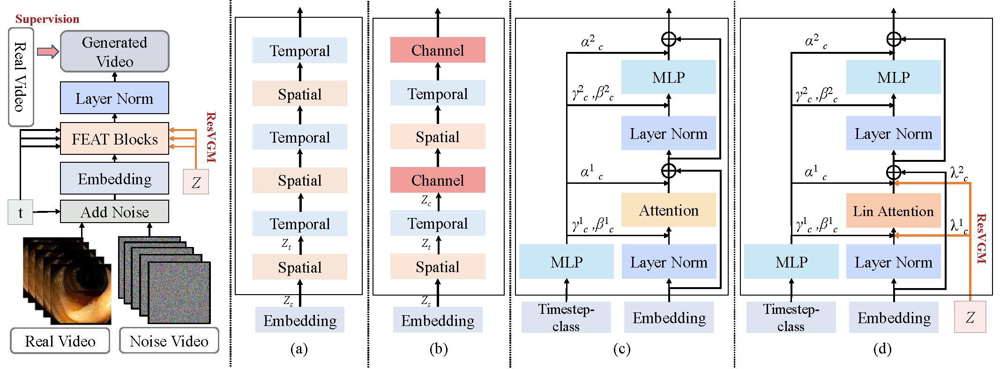

# *FEAT*


### [ArXiv Paper](https://arxiv.org/abs/)
### Accepted by International Conference on Medical Image Computing and Computer Assisted Intervention (MICCAI 2025) 

[Huihan Wang]()<sup>1* </sup> [Zhiwen Yang]()<sup>1*</sup> [Hui Zhang]()<sup>2</sup> [Dan Zhao]()<sup>3</sup> [Bingzheng Wei]()<sup>4</sup> [Yan Xu](https://bme.buaa.edu.cn/teacherInfo.aspx?catID=7&subcatID=141&curID=487)<sup>1</sup> ✉</sup>

<sup>1</sup>BUAA &emsp; <sup>2</sup>THU &emsp; <sup>3</sup>PUMC &emsp; <sup>4</sup>ByteDance &emsp;

<sup>\*</sup> Equal Contributions. <sup>✉</sup> Corresponding Author. 

FEAT: Full-Dimensional Efficient Attention Transformer for Medical Video Generation (MICCAI 2025) (Early Accept (9%))


https://github.com/user-attachments/assets/c0b3a5a7-8ef0-4524-a057-369278a9fb16




## 🛠Setup

```cmd
git clone https://github.com/Yaziwel/FEAT.git
cd FEAT
conda create -n FEAT python=3.10
conda activate FEAT

pip install torch==2.1.2 torchvision==0.16.2 torchaudio==2.1.2 --index-url https://download.pytorch.org/whl/cu118

pip install -r requirements.txt
```

## 📚Data Preparation
**Colonoscopic**:  The dataset provided by [paper](https://ieeexplore.ieee.org/abstract/document/7442848) can be found [here](http://www.depeca.uah.es/colonoscopy_dataset/). You can directly use the [processed video data](https://mycuhk-my.sharepoint.com/:u:/g/personal/1155167044_link_cuhk_edu_hk/ES_hCHb2XWFJgsK4hrKUnNUBx3fl6QI3yyk9ImP4AkkRVw?e=LC4DU5) by *[Endo-FM](https://github.com/openmedlab/Endo-FM)* without further data processing.

**Kvasir-Capsule**:  The dataset provided by [paper](https://www.nature.com/articles/s41597-021-00920-z) can be found [here](https://datasets.simula.no/kvasir-capsule/). You can directly use the [processed video data](https://mycuhk-my.sharepoint.com/:u:/g/personal/1155167044_link_cuhk_edu_hk/EQhyk3_yz5pAtdpKVFU93S0BfPfTNpblPFXTHaW-BIjV-Q?e=9duP5z) by *[Endo-FM](https://github.com/openmedlab/Endo-FM)* without further data processing.

Please run [`process_data.py`](process_data.py) and [`process_list.py`](process_list.py) to get the split frames and the corresponding list at first.
```cmd
CUDA_VISIBLE_DEVICES=gpu_id python process_data.py -s ./data/Colonoscopic -t ./data/Colonoscopic_frames

CUDA_VISIBLE_DEVICES=gpu_id python process_list.py -f ./data/Colonoscopic_frames -t ./data/Colonoscopic_frames/train_128_list.txt
```

The resulted file structure is as follows.
```
├── data
│   ├── Colonoscopic
│     ├── 00001.mp4
|     ├──  ...
│   ├── Kvasir-Capsule
│     ├── 00001.mp4
|     ├──  ...
│   ├── Colonoscopic_frames
│     ├── train_128_list.txt
│     ├── 00001
│           ├── 00000.jpg
|           ├── ...
|     ├──  ...
│   ├── Kvasir-Capsule_frames
│     ├── train_128_list.txt
│     ├── 00001
│           ├── 00000.jpg
|           ├── ...
|     ├──  ...
```

## ⏳Training

You can follow the steps below to train FEAT:

```bash
bash train_scripts/col/train_col.sh
bash train_scripts/kva/train_kva.sh
```

## 🎇Sampling

You can directly sample the endoscopy videos from the checkpoint model. Here is an example for quick usage for using our **pre-trained models**:

1. Download the pre-trained weights from [here](https://drive.google.com/drive/folders/1OGAcuYwTc5KicspmTBniRuSWgy-XwebF?usp=sharing) and put them to specific path defined in the configs.
2. Run [`sample.py`](sample/sample.py) by the following scripts to customize the various arguments like adjusting sampling steps. 

You can follow the steps below to sample a video by using FEAT:

```bash
bash sample/col.sh
bash sample/kva.sh
```
DDP sample:
```bash
bash sample/col_ddp.sh
bash sample/kva_ddp.sh
```

After the DDP sample, there will be more than 3125 videos generated to calculate the metrics.

## 📏Evaluation

The metrics we calculated in Colonoscopic dataset:

| Method        | FVD↓   | CD-FVD↓ | FID↓   | IS↑  |
| ------------- | ------ | ------- | ------ | ---- |
| StyleGAN-V    | 2110.7 | 1032.8  | 226.14 | 2.12 |
| LVDM          | 1036.7 | 792.9   | 96.85  | 1.93 |
| MoStGAN-V     | 468.5  | 592.0   | 53.17  | 3.37 |
| Endora        | 460.7  | 545.3   | 13.41  | 3.90 |
| FEAT-S (Ours) | 415.4  | 444.0   | 13.34  | 3.96 |
| FEAT-L (Ours) | 351.1  | 397.0   | 12.31  | 4.01 |

Before calculating the metrics in our codes, you may need the weights for several models, which can be downloaded from the following links:

- [Inception v3](https://nvlabs-fi-cdn.nvidia.com/stylegan2-ada-pytorch/pretrained/metrics/inception-2015-12-05.pt) for calculating FID and IS.
- [I3D](https://www.dropbox.com/s/ge9e5ujwgetktms/i3d_torchscript.pt?dl=1) for calculating FVD.
- [Videomae](https://huggingface.co/OpenGVLab/InternVideoMAE_models/resolve/main/mae-g/vit_g_hybrid_pt_1200e_ssv2_ft.pth) for calculating CD-FVD.

You can also simply follow this part of the code in [Endora](https://github.com/CUHK-AIM-Group/Endora) to automatically download models from the internet for metric calculation.

To calculate the metrics, you can follow the steps below to evaluate the model.  

```cmd
## FVD, FID and IS
CUDA_VISIBLE_DEVICES=gpu_id python process_data.py -s /path/to/generated/video -t /path/to/video/frames
cd /path/to/stylegan-v
CUDA_VISIBLE_DEVICES=gpu_id python ./src/scripts/calc_metrics_for_dataset.py \
  --fake_data_path /path/to/video/frames \
  --real_data_path /path/to/dataset/frames 
  
## CD-FVD
CUDA_VISIBLE_DEVICES=gpu_id python calculate_cdfvd.py
```

## 🧰Running Other Methods

As we follow the work Endora, you can run other methods the same way as how [Endora](https://github.com/CUHK-AIM-Group/Endora) described.

## 🎪Downstream Application

As we follow the work Endora, you can run the downstream task the same way as how [Endora](https://github.com/CUHK-AIM-Group/Endora) described.

|Method|Colonoscopic |
|-----|------|
|Supervised-only | 74.5  |
|LVDM | 76.2  |
|Endora| 87.0 |
|FEAT-S (ours)| 89.9 |
|FEAT-L (ours)| 91.3 |

```
## 🎈Acknowledgements
Greatly appreciate the tremendous effort for the following projects!
- [Endora](https://github.com/CUHK-AIM-Group/Endora)
- [Endo-FM](https://github.com/openmedlab/Endo-FM)
- [Latte](https://github.com/Vchitect/Latte)
- [EndoGaussian](https://github.com/yifliu3/EndoGaussian)
- [CoMatch](https://github.com/salesforce/CoMatch)
- [Stylegan-v](https://github.com/universome/stylegan-v)

## 📜Citation
If you find FEAT useful in your research, please consider citing:
```
@article{wang2025feat,
  author    = {Huihan Wang and Zhiwen Yang and Hui Zhang and Dan Zhao and Bingzheng Wei and Yan Xu},
  title     = {FEAT: Full-Dimensional Efficient Attention Transformer for Medical Video Generation},
  journal   = {arXiv preprint arXiv:xxxx},
  year      = {2025}
}
